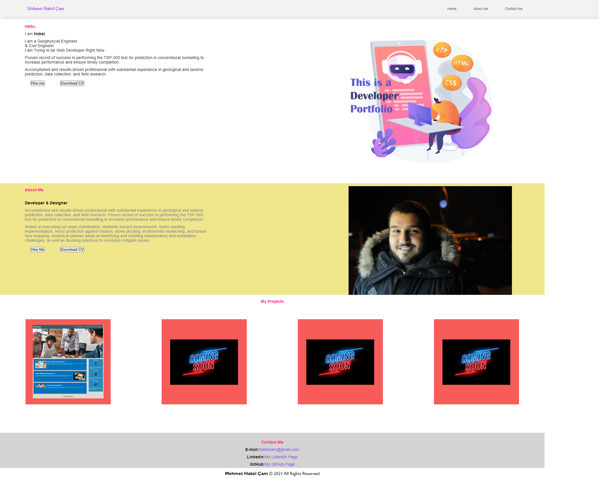

# Portfolio Web Page

## Project link

Click [here](https://hakkelo89.github.io/homework-week-2/) to view project on GitHub pages

## Description

Creating Portfolio Web Page from Scratch

## What did I do?

I created portfolio web page from the scratch
I used semantic Html Elements and flex command.

## Screenshots

## Link to Deployed Application

https://hakkelo89.github.io/homework-week-2/
